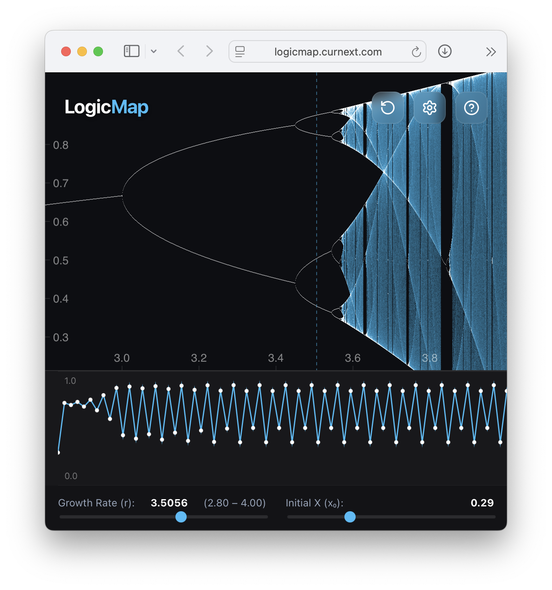

# LogicMap

A beautiful, interactive visualization of the **Logistic Map**—the simple equation that reveals the edge of chaos.

👉 **Live Demo**: [logicmap.curnext.com](https://logicmap.curnext.com)



## About

**LogicMap** is an educational tool designed to make Chaos Theory intuitive and accessible. It visualizes the famous [logistic map](https://en.wikipedia.org/wiki/Logistic_map) equation:

$$x_{n+1} = r \cdot x_n \cdot (1 - x_n)$$

Through an interactive interface, users can explore how changing a single variable ($r$, the growth rate) transitions a system from stability to periodicity, and finally into pure chaos.

### Features

- **Interactive Bifurcation Diagram**: Explore the fractal structure of the logistic map.
- **Animated Cobweb Plot**: Visualize the iterative process step-by-step.
- **Guided Introduction**: A built-in crash course on the "Edge of Chaos" and the Butterfly Effect.
- **Real-time Controls**: Adjust simulation speed, detail level, and visual parameters.

## Tech Stack

- **Framework**: [Svelte 5](https://svelte.dev/)
- **Build Tool**: [Vite](https://vitejs.dev/)
- **Language**: TypeScript
- **Styling**: CSS / Tailwind utilities

## Local Development

1. **Clone the repository**
   ```bash
   git clone https://github.com/curnext/logicmap.git
   cd logicmap
   ```

2. **Install dependencies**
   ```bash
   npm install
   ```

3. **Start the development server**
   ```bash
   npm run dev
   ```

4. **Build for production**
   ```bash
   npm run build
   ```
